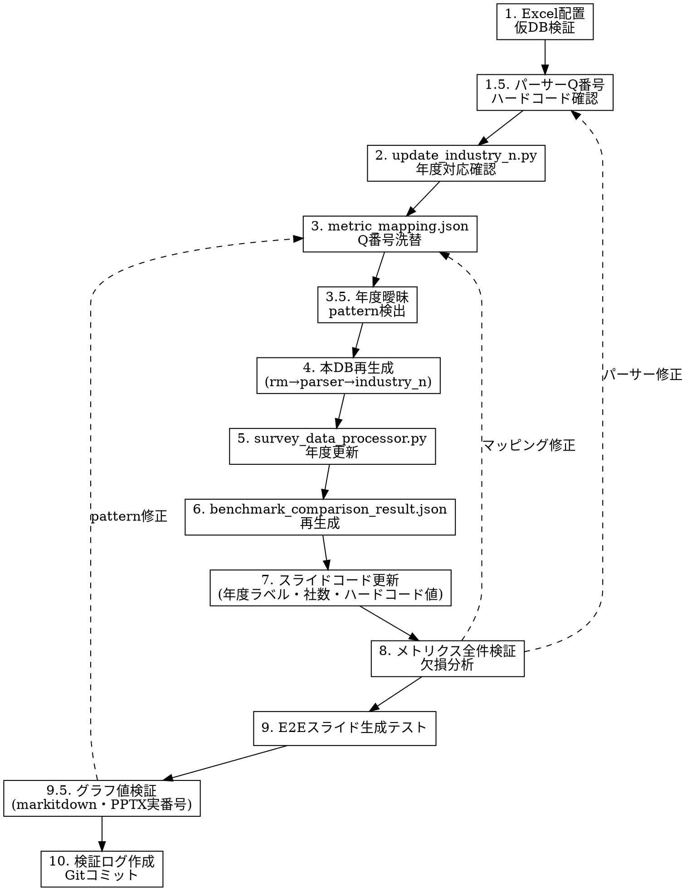

# 平均データ洗替（Benchmark Data Refresh）

## Overview

毎年度の健康経営度調査票集計データ（平均Excel）を受領した際に、分析レポートのベンチマーク基盤を安全に更新する手順。DB再生成・Q番号マッピング・スライドコード更新・検証の全工程をカバーする。

**鉄則**:
- 数値ハードコード禁止。グラフ・平均値は必ずExcel/DB由来で取得する。
- DB欠損は手動INSERTでなくパーサー修正で根本対応する。Excelにデータがあるならパーサーを直すのが正解。

## ディレクトリ構成と主要ファイル

```
backend/FY25/survey_report/
  benchmark_parser.py              # Excel→benchmark.db変換（Q番号ハードコードあり要注意）
  update_industry_n.py             # 業種別企業数の更新（全体シートから抽出）
  survey_data_processor.py         # benchmark.db→benchmark_comparison_result.json生成
  metric_mapping.json              # ~160メトリクスのDB問合せ定義（q_id, sub_q_id, column_signature_pattern）
  benchmark.db                     # SQLite（benchmark_raw + benchmark_industry_n）
  benchmark_comparison_result.json # スライド描画用の比較結果JSON
  extracted_survey_data.json       # 企業回答データ（抽出済み）
  kenkoukeieidochousa_kaito4_YYYY.xlsx  # 平均Excel（年度ごと）

backend/src/api/
  analysis_report.py               # スライド生成オーケストレーション
  slide/
    utils.py                       # フッター年度表記・社数（FOOTER_BENCHMARK_OVERALL等）
    slide_cover.py                 # 表紙（令和N年度デフォルト引数）
    slide_overview.py              # 概要（令和N年度テキスト）
    slide_solution.py              # ソリューション提案①（SOLUTION_TABLE_DATA: ハードコード平均値）
    slide_solution_ext.py          # ソリューション提案②（SOLUTION_EXT_TABLE_DATA: 同上）
    slide_medical_visit.py         # 産業医・保健師（フッター年度）
    slide_work_hours.py            # 労働時間（2021年度/2024年度系列ラベル）
    slide_stress_check.py          # ストレスチェック（タイトルQ番号表示）
    slide_benchmark_participation.py # 参加率ベンチマーク
    graph/
      data_mapper.py               # 共通描画（"2024年度"系列ラベル）
      config.py                    # company_2024 カラーキー

docs/analysis-report/
  requirements/
    survey_report_development_guide.md  # 開発ルール（必読）
    average_excel_data_extraction.md    # 平均Excel取り扱いルール
    benchmark_triage.md                 # 不具合切り分け手順
  verification/                         # 検証ログ格納先
```

## 実行手順



### Step 1: Excel配置と仮DB検証

```bash
cd backend/FY25/survey_report
cp /path/to/new_average_excel.xlsx .

# 本DBを壊さず仮DBで先行検証
python benchmark_parser.py new_excel.xlsx /tmp/benchmark_preview.db
python update_industry_n.py new_excel.xlsx /tmp/benchmark_preview.db

sqlite3 /tmp/benchmark_preview.db "
  SELECT MIN(year), MAX(year), COUNT(*) FROM benchmark_raw;
  SELECT year, file_type, COUNT(*) FROM benchmark_raw GROUP BY year, file_type ORDER BY year, file_type;
  SELECT year, COUNT(*) FROM benchmark_industry_n GROUP BY year;
"
```

**確認**: 新年度のyearが追加されているか。overall/cross_analysis/industry の3 file_type が揃うか。

**正常値の目安（3年分）**: ~320,000件、~100MB

### Step 1.5: パーサーのQ番号ハードコード確認（重要）

`benchmark_parser.py` の `extract_sub_q_id()` にQ番号がハードコードされている。年度更新でQ番号がずれるとパーサーが対象ブロックを認識できず、データが欠損する。

```bash
# パーサー内のQ番号ハードコードを検索
grep -n 'startswith.*Q[0-9]' benchmark_parser.py
```

**FY26時点のハードコード箇所**:
- `startswith(("Q68", "Q70"))`: 長時間労働の特殊パース（45h/80h/年間延べ/ピーク月）
- `startswith("Q27")`: 産業医/保健師の人数/日数分離パース

新年度でこれらのQ番号が移動したら、パーサーの `startswith` に新旧両方のQ番号を追加する。例:
```python
# FY26での修正例: Q70→Q68
question_text.startswith(("Q68", "Q70"))  # 新旧両対応
```

### Step 2: Q番号洗替（metric_mapping.json）

毎年Q番号が変わるため、`metric_mapping.json` の `benchmark_query.q_id` を更新する。

**手順**:
1. ハンドオフ資料のQ番号対応表を起点にする
2. **必ず仮DBで実データ検証** — 推測で更新しない
3. `sub_q_id` と `column_signature_pattern` はDB実値で照合

```sql
-- Q番号移動の確認例: 旧Q66が新DBに存在するか
SELECT DISTINCT q_id FROM benchmark_raw WHERE year=NEW_YEAR AND q_id='Q66';
-- 空なら移動している。新Q番号を探す:
SELECT DISTINCT q_id, sub_q_id, column_signature 
FROM benchmark_raw 
WHERE year=NEW_YEAR AND column_signature LIKE '%ストレス%' AND file_type='overall'
LIMIT 20;
```

**過去の教訓**:
- ハンドオフ資料に載っていないQ番号移動がある（FY26ではQ27→Q25, Q36→Q34が未記載だった）
- `column_signature` のキーワード検索で発見できる
- `_2023_` → `_2024_` のような年次パターン埋め込みも更新が必要（17件/FY26）
- sub_q_id の粒度が変わることがある（詳細→simple a/b統合など）

#### column_signature_pattern の年度区別（重要・FY26で10件の不具合原因）

同一sub_q_idで複数年度のデータが存在する場合（Q68長時間労働の2021/2024年度ブロック等）、`column_signature_pattern: "%平均%"` だと両年度にマッチしてしまう。`survey_data_processor.py` の `_pick_best_value()` は `sig_year` 正規表現 `(\d{4})` で**最新年度を優先**するため、2021年度のメトリクスに2024年度の値が入る。年度ごとにpatternで区別する:

```json
// 2024年度データ
"column_signature_pattern": "%_2024_%平均%"
// 2021年度データ  
"column_signature_pattern": "%_2021_%平均%"
```

**判断方法**: DB内のcolumn_signatureを確認し、年度が含まれているかチェック:
```sql
SELECT column_signature FROM benchmark_raw 
WHERE q_id='Q68' AND sub_q_id='over_45h_annual_per_person' 
  AND column_signature LIKE '%平均%' AND file_type='overall' AND category='全体';
-- → Q68_over_45h_annual_per_person_2024_平均
-- → Q68_over_45h_annual_per_person_2021_平均
```

**FY26で修正した対象メトリクス**（10件、いずれも `%平均%` → `%Q{num}_{a|b}_{2021|2024}_平均%`）:

| metric_id | 修正後 pattern |
|---|---|
| `checkup_rate_1/2/3/4` | `%Q34_{a|b}_{2021|2024}_平均%` |
| `work_time_val_1/2/3/4` | `%Q67_{a|b}_{2021|2024}_平均%` |
| `paid_leave_rate`, `paid_leave_rate_2` | `%Q67_c_{2024|2021}_%平均%` |
| `paid_leave_days_1`, `paid_leave_days_2` | `%Q67_d_{2024|2021}_%平均%` |

**自動検出スクリプト**:
```sql
-- 同一 (year, q_id, sub_q_id, category, file_type) で複数の「平均」列があるもの
SELECT year, q_id, sub_q_id, category, file_type, COUNT(*) as cnt,
       GROUP_CONCAT(column_signature) as sigs
FROM benchmark_raw
WHERE column_signature LIKE '%平均%' AND file_type IN ('overall','cross_analysis')
GROUP BY year, q_id, sub_q_id, category, file_type
HAVING cnt > 1;
```
ここに出た `q_id + sub_q_id` を `metric_mapping.json` で検索し、patternが `%平均%` のままなら年度明示が必要。

### Step 3: 本DB再生成

```bash
rm -f benchmark.db
python benchmark_parser.py new_excel.xlsx benchmark.db
python update_industry_n.py new_excel.xlsx benchmark.db
```

**鉄則**: 必ず `rm -f benchmark.db` してから再生成。`INSERT OR REPLACE` ではスキーマ変更に対応できない。

**Q30（課題共有の場）**: パーサーが複数選択肢構造を正しくパースできない既知問題。DB再生成後に手動挿入が必要:
```sql
-- Q30 の例（値はExcelから直接確認）
INSERT INTO benchmark_raw (year, file_type, q_id, sub_q_id, category, column_signature, value)
VALUES (NEW_YEAR, 'overall', 'Q30', 'mgmt_initiatives', '全体', 'Q30_mgmt_initiatives_回答者数', XXXX);
```

### Step 4: survey_data_processor.py 年度更新

以下の固定値を新年度に更新:
- `WHERE year=YYYY`（複数箇所）
- `benchmark_year = YYYY`
- `get_industry_company_count(year=YYYY)` デフォルト引数

また、月次換算ロジックに新年度のmetric_idが含まれているか確認:
```python
# 年間延べ→月次換算（×100/12）
if metric_id in {"long_hours_workers_45h_2024", ..., "long_hours_workers_45h_2021", ...}:
# ピーク月（×100のみ、12で割らない）
if metric_id in {"peak_month_workers_45h_2024", ..., "peak_month_workers_45h_2021", ...}:
```

### Step 5: benchmark_comparison_result.json 再生成

```bash
python survey_data_processor.py "企業調査票ファイル名.xlsx"
```

### Step 6: スライドコード更新

#### 6a. 令和年度 + 提出企業社数

更新箇所（毎年固定）:

| ファイル | 箇所 |
|---|---|
| `utils.py` | `令和N年度、X,XXX社` テキスト（3箇所） |
| `slide_overview.py` | subtitle 内の「令和N年度」 |
| `slide_cover.py` | デフォルト引数 `comparison_data` |
| `slide_medical_visit.py` | フッター注記 |

**社数の取得**:
```sql
SELECT value FROM benchmark_raw 
WHERE year=NEW_YEAR AND file_type='overall' AND q_id='Q1' 
  AND category='全体' AND column_signature LIKE '%回答者数%'
LIMIT 1;
```

**検索コマンド**:
```bash
grep -rn '令和' backend/src/api/slide/*.py
```

#### 6b. ソリューション提案ハードコード平均値

`slide_solution.py` の `SOLUTION_TABLE_DATA` と `slide_solution_ext.py` の `SOLUTION_EXT_TABLE_DATA` に他社平均値がハードコードされている。

**DB確定可能な項目の算出方法**:

| パターン | 算出方法 | 例 |
|---|---|---|
| 二値（実施有無） | `該当レコード数 / 回答者数 × 100` | Q17SQ2, Q56c, Q58, Q75 |
| 率の平均 | `column_signature LIKE '%平均%'` | Q34b, Q36 |
| 人数の平均 | Excel該当シートの「平均」セル直接確認 | Q25a, Q25b |

**毎年Excel直接確認が必要な項目**（DB構造から算出困難）:

| Q番号 | 内容 | Excel確認のコツ |
|---|---|---|
| Q25a/b | 産業医/保健師人数 | DBの平均値は人数・日数・割合の混在で不正確。Excel該当行のCol 12 |
| Q30 | 課題共有の場 | 複数選択肢。ExcelのH列で該当社数を確認し÷回答者数 |
| Q42 | 育児研修 | ExcelのD列の%値を直接使用 |
| Q44×3 | 介護研修 | ExcelのK/L/M列。SQ構造が年度で変わる |
| Q47 | 治療費補助 | ExcelのG列 |
| Q48 | 女性健康セミナー | 「特に行っていない」と「無回答」を除いた社数÷回答者数 |
| Q51 | 特定保健指導オンライン | ExcelのJ列の%値 |
| Q75 復職 | 復職プログラム | ExcelのD列の%値 |

#### 6b-2. `survey_data_processor.py` の `PDF_HARDCODED_AVG`（分布→加重平均で再計算する項目）

`survey_data_processor.py` 先頭の `PDF_HARDCODED_AVG` に、**DBに平均列が無く分布のみ格納**されているためにハードコード運用している項目がある。**値は毎年FY最新値に更新する**。DB化は難しいが、再計算は1コマンドで可能。

| metric_id | 設問 | DB元データ | 再計算式 |
|---|---|---|---|
| `health_guidance_by_physician_nurse_rate` | Q53SQ1 保健指導実施割合 | `Q53SQ1_2024_{2割未満,2割以上5割未満,5割以上8割未満,8割以上,把握していない,無回答}` | `(n1×10 + n2×35 + n3×65 + n4×90) / 回答者数`（把握していない/無回答は 0% 扱い） |

**再計算コマンド（overall）**:
```bash
sqlite3 benchmark.db "
  SELECT column_signature, value FROM benchmark_raw
   WHERE year=NEW_YEAR AND file_type='overall' AND q_id='Q53SQ1'
     AND category='全体' AND column_signature LIKE 'Q53SQ1_%';"
# 得られた実数で
python3 -c "
n1,n2,n3,n4,total = 1141,567,424,1649,3811  # ←DBから差し替え
print(round((n1*10+n2*35+n3*65+n4*90)/total, 1))"
```

**W500 / 銘柄は `file_type='cross_analysis'` で取得**（値は％表示なので分母は 100）。

**業種別は `file_type='industry'` で取得**（値は％表示なので分母は 100）。識別された企業業種（`identify_industry()` の戻り値: 例「卸・小売」「金融」など）に応じて `PDF_HARDCODED_AVG_BY_INDUSTRY[metric_id][業種名]` をセットする。

**鉄則（平均値の完全更新）**: 平均に関する更新指摘を受けたら、**必ず overall / W500 / 銘柄 / 業種別の4系統すべて**をFY最新値に再計算・更新する。一部だけ更新すると年度間の整合が崩れる（例: FY26対応で overall だけ更新し W500/銘柄/業種が前年値で残ると、スライドで不整合な比較になる）。

**重要**: Q53SQ1 は「コード1-5の代表値変換」で加重平均を取る特殊設計。選択肢変更（代表値の見直し）が発生したら `_map_sq1_health_guidance_rate_to_percent()` も更新する。FY26時点のマッピングは: 1→10, 2→35, 3→65, 4→90, 5→0。

**更新時の必須記載**: `PDF_HARDCODED_AVG` のコメント直上に「出典・計算式・SQLコマンド・FY値（overall/W500/銘柄/業種別すべて）」を記載し、次年度担当者が再計算できる状態を保つ。業種別は 15業種分（その他法人/その他製品/不動産・サービス/医療・社会福祉法人、保険者/卸・小売/情報・通信/機械・精密・輸送用機器/水産・農林・鉱・建設/素材・金属/繊維・紙パルプ・化学・医薬品/金融/電気・ガス・運輸/電気機器/食料品 など）を網羅する。

#### 6c. 企業データ年度ラベル（「2024年度」等）

`data_mapper.py`, `config.py`, 各スライドモジュールの「YYYY年度」系列ラベル・metric_idサフィックス・カラーキー名。

**注意**: 「2024年度」「2021年度」は企業調査票の設問が対象とする年度（FY2024実績・FY2021実績）を指す。ベンチマーク平均年度とは無関係。調査票の設問対象年度が変わらない限り更新不要。

### Step 7: メトリクス全件検証

```bash
python survey_data_processor.py "企業調査票ファイル名.xlsx"
```

全メトリクス × 3カテゴリ（全体/W500/銘柄）の取得状況を確認。欠損があればStep 2（マッピング修正）またはStep 1.5（パーサー修正）に戻る。

**欠損の分類と対応**:

| 分類 | 原因 | 対応 |
|---|---|---|
| マッピングミス | Q番号・sub_q_id・pattern不一致 | metric_mapping.json修正 → JSON再生成 |
| パーサー未対応 | Excelにデータはあるがparserが読めていない | benchmark_parser.py修正 → DB再生成 → JSON再生成 |
| データ構造変更 | 新年度でsub_q_id粒度変更、シート欠落 | 修正不可（検証ログに記録） |

**パーサー未対応の見分け方**: Excelの該当設問を目視確認してデータが存在するのにDBに無い場合。手動INSERTではなく、パーサー修正で対応する。

### Step 8: E2Eスライド生成テスト

```python
import sys, os, json, shutil
backend_dir = os.path.abspath("backend")
survey_dir = os.path.join(backend_dir, "FY25", "survey_report")
sys.path.insert(0, backend_dir)
sys.path.insert(0, survey_dir)
sys.path.insert(0, os.path.join(backend_dir, "src", "api", "slide", "graph"))
os.chdir(survey_dir)

with open("benchmark_comparison_result.json") as f:
    json_data = json.load(f)
from src.api.analysis_report import _generate_pptx_from_json
result = _generate_pptx_from_json(json_data, "/tmp/e2e_test.pptx")
shutil.copy(result, "/tmp/e2e_test.pptx")  # _generate_pptx_from_jsonはtempfileを返すため必ずコピー

from pptx import Presentation
prs = Presentation("/tmp/e2e_test.pptx")
print(f"Total slides: {len(prs.slides)} ({os.path.getsize('/tmp/e2e_test.pptx')/1024:.0f}KB)")
```

エラーなしで全スライドが生成されればOK。null値のグラフ描画でクラッシュしないかも確認。

**注意（FY26で踏んだ罠）**:
- `_generate_pptx_from_json` は**tempfileのパスを返す**。第2引数のパスには保存されないので、必ず `shutil.copy(result, dest)` すること。
- `sys.path.insert` に渡すのは**絶対パス**必須。相対パス `backend` だと `ModuleNotFoundError: No module named 'src.api'` になる。

### Step 8.5: グラフ値の網羅的検証（markitdown使用・必須）

スライド単位でグラフ内の数値が全て表示されているか、Excel設問・調査票設問と対応しているか確認する。

```bash
# テキスト抽出
python -m markitdown /tmp/e2e_test.pptx > /tmp/e2e_test.md

# 各スライドのタイトル一覧（PPTX実番号）
python -c "
from pptx import Presentation
prs = Presentation('/tmp/e2e_test.pptx')
for i, slide in enumerate(prs.slides, 1):
    for shape in slide.shapes:
        if shape.has_text_frame and shape.text_frame.text.strip():
            print(f'Slide {i}: {shape.text_frame.text.strip().split(chr(10))[0][:80]}')
            break
"

# 欠損マーカー検索（意図しないnull/—/実施無し）
grep -nE '(—|実施無し|データなし|\bnull\b|N/A)' /tmp/e2e_test.md

# スライド番号行インデックス
grep -n '^<!-- Slide number:' /tmp/e2e_test.md
```

**重要**: `build_slide_*` 関数数（17個）と実PPTXスライド数（22枚）は**一致しない**。以下の関数は①②の2枚を生成する:

| 関数 | 実スライド内容 | PPTX番号（FY26実績） |
|---|---|---|
| `build_slide_demographics` | ①②（会社概要・属性） | 3, 4 |
| `build_slide_medical_visit` | ①②（医療機関受診率 / Q25） | 7, 8 |
| `build_slide_work_hours` | ①②（労働時間 / 有給休暇） | 14, 15 |
| `build_slide_disease` | ①②（メンタル / 他疾病） | 16, 17 |
| `build_slide_stress_check` | ①②（受検率 / エンゲージメント） | 18, 19 |

検証MDファイルを作るときは**実PPTX番号**（22枚）で作成すること。機能単位（17個）で作ると実番号とずれてユーザーの指摘（「スライド18が…」）に対応できない。

**検証観点（4つ必須）**:
1. **グラフ値表示**: 意図しないnull/—/空欄がないか
2. **Excel設問対応**: 平均Excelの該当シート・セル値と一致するか
3. **調査票設問対応**: 企業調査票のQ番号・設問文がスライド表示と一致するか
4. **DB-JSON整合**: `benchmark_comparison_result.json` の値がDB実測と一致するか

**意図的な貴社のみ表示**: Slide 11 介護「5年以内発生可能性」等は仕様。スライドのコメント（`※…貴社結果のみを表示しています`）で判別。

### Step 9: 検証ログ + Gitコミット

`docs/analysis-report/verification/YYYYMMDD_fyNN_average_refresh_check.md` を作成:
- 実行日・実行コマンド
- DB件数（year/file_type別）
- Q番号マッピング変更一覧
- 欠損メトリクス件数と内訳
- 過去指摘の再発確認
- 未解決項目

## Quick Reference: 毎年変わるもの一覧

| 対象 | 何が変わるか | 確認方法 |
|---|---|---|
| Q番号 | 設問番号の入替（毎年10-20件） | ハンドオフ資料 + DB実測 |
| column_signature内の年次 | `_2023_` → `_2024_` 等 | `grep '_20[0-9][0-9]_' metric_mapping.json` |
| sub_q_id | 粒度変更（詳細→統合等） | DB実測で確認 |
| 令和年度 | スライドフッター・タイトル | `grep '令和' backend/src/api/slide/*.py` |
| 提出企業社数 | フッター注記 | Excel全体シートの回答者数 or DB Q1回答者数 |
| ハードコード平均値 | ソリューション提案テーブル | DB算出 + Excel直接確認 |
| PDF_HARDCODED_AVG | `survey_data_processor.py` 冒頭の分布ベース値（Q53SQ1等） | 当該エントリのコメント記載SQLで再計算 |
| survey_data_processor.py | WHERE year=YYYY 等 | `grep 'year.*=' survey_data_processor.py` |
| 企業データ年度ラベル | 「2024年度」等の系列名 | 企業調査票の対象年度（平均年度とは無関係） |
| benchmark_parser.py | Q番号ハードコード（startswith） | `grep 'startswith.*Q' benchmark_parser.py` |

## Common Mistakes

| ミス | 結果 | 防止策 |
|---|---|---|
| `rm benchmark.db` せずに再生成 | 旧レコードが残留しデータ混在 | 必ず削除してから再生成 |
| `update_industry_n.py` 実行忘れ | `benchmark_industry_n` が空 | DB再生成後に必ず実行 |
| sub_q_id と column_signature_pattern の不一致 | クエリが空を返す（null表示） | DB実値で照合 |
| ハンドオフ資料のQ番号だけで洗替 | 未記載のQ番号移動が漏れる | DB実測で全件検証 |
| benchmark_comparison_result.json 再生成忘れ | スライドに旧年度の平均値が表示される | mapping変更後は必ず再生成 |
| 令和年度の更新漏れ | フッターに旧年度が表示される | `grep '令和'` で全箇所確認 |
| benchmark_parser.py の Q番号ハードコード未更新 | 特殊パースが動かずデータ欠損 | `grep 'startswith.*Q' benchmark_parser.py` |
| DB欠損を手動INSERTで対処 | 次回再生成時にデータ消失 | パーサー修正で根本対応 |
| column_signature_pattern に年度未指定 | 2021/2024データが混在マッチし最新年度に寄る | 同一sub_q_idの複数年度はpatternで区別（Step 2参照） |
| `_SKIP_PATTERNS` 未確認 | 異常シート混入でDB肥大化 | 正常サイズ ~100MB/3年分 |
| 検証MDを `build_slide_*` 関数単位で作成 | ユーザー指摘「スライド18…」に対応不可 | PPTX実番号（22枚）で作成 |
| `_generate_pptx_from_json` の返り値無視 | 意図したパスに保存されない | 返り値を `shutil.copy` |
| `sys.path.insert` に相対パス | `ModuleNotFoundError: src.api` | `os.path.abspath` で絶対化 |
| スライド参加率の設問表示が古いQ番号 | ユーザーに誤情報表示 | `PARTICIPATION_TABLE_ROWS` の「設問」列も更新 |

## FY26実績（参考値）

| 項目 | 値 |
|---|---|
| Q番号変更 | 92件（ハンドオフ82件 + DB実測で追加10件） |
| 年次パターン変更 | 17件（`_2023_` → `_2024_`） |
| 年度曖昧バグ修正 | 10件（Q34 checkup_rate×4、Q67 work_time_val×4、paid_leave×2） |
| Q55 q_idコピペバグ修正 | 3件（q55_exercise_sq1_* / sq2_*） |
| metric_mapping.json総数 | 159メトリクス |
| benchmark.db | 321,429件、99MB（2023/2024/2025の3年分） |
| 全体シート回答者数 | 4,175社 |
| E2E生成 | 22スライド、434KB（※`build_slide_*`関数は17個） |
| 未記載Q番号移動 | Q27→Q25（6件）、Q36→Q34（4件） |
| 検証MDファイル | `docs/analysis-report/verification/slide_audit_YYYYMMDD/` に22枚分 |

## 次年度引き継ぎ: 既知の残課題

1. **Q25 産業医/保健師（旧Q27）: FY26で解決済み**:
   - `benchmark_parser.py` のQ27特殊パースを `startswith(("Q25", "Q27"))` に拡張し、sub_q_id を `a_1_headcount` / `a_1_per_employee` / `a_2_days` / `a_2_days_per_1000`（b_*含む8種）に分離。
   - `metric_mapping.json` の6メトリクス（`occupational_physician_count` / `_ratio` / `_hours_per_1000` と保健師版）を新sub_q_idに更新。
   - `occupational_physician_ratio` / `public_health_nurse_ratio` は Excel原値が「%記号なし百分率」(0.391) のため `PERCENT_POINT_METRICS` に登録し自動 ×100 を回避。
   - 企業値は 0-1 小数のため `MULTIPLY_100_COMPANY_ONLY` で ×100 してavgと同スケール (0.14 vs 0.39) に揃える。
   - **FY27引き継ぎ**: Q番号が再移動したら `startswith()` に新Q番号を追加、metric_mapping.json の q_id を更新。sub_q_id 構造は維持されるため、column_signature_pattern に新Q番号ベースが入るよう確認。
2. **Q68 長時間労働（旧Q70）**: FY26でパーサー修正済み（`startswith(("Q68", "Q70"))`）。FY27でQ番号が再移動したらstartsWithに追加が必要。
3. **Q44SQ1 介護休業（care_leave_*）**: 詳細sub_q_id（b_awareness_rate_male等）が2025年DBでsimple a/bに統合。2024年DBのデータにフォールバック中（12件）。Q44SQ1SSQ1のパーサー未対応により発生。今後もこの粒度変更が続く可能性あり。
4. **ソリューション提案のハードコード**: Q25a/b, Q30, Q42, Q44, Q47, Q48, Q51は毎年Excel直接確認が必要。根本対応としてDB/JSON由来に変更すべき。
4-b. **`PDF_HARDCODED_AVG` の Q53SQ1（保健指導実施割合）**: DBには分布のみで平均列が無いため値をハードコード。毎年FY最新値に再計算すること。FY26で 55.5（FY24固定）→ 54.4（FY25再計算）に更新。W500(79.7) / 銘柄(85.1) はFY24値のまま残置。FY27洗替時に cross_analysis の W500/銘柄 分布から加重平均を再計算して更新する。計算式とSQLは `survey_data_processor.py` の当該エントリ直上コメント参照。
5. **Q30 複数選択肢**: パーサーが複数選択肢構造を正しくパースできない。DB再生成のたびに手動挿入が必要。パーサー拡張で対応すべき。
6. **Q55 運動習慣の mapping バグ（FY26で修正済み）**: metric_mapping.json で `q55_exercise_*` の q_id が `Q54SQ1/Q54SQ2` になっていてQ54(食生活)と同値を表示していた。FY27以降も同系設問（Q46/Q48/Q54/Q55/Q68）は**q_idコピペバグ**に注意。検証時に以下を実行:
   ```bash
   # Q55系統のq_idが正しいか
   python -c "
   import json
   m = json.load(open('backend/FY25/survey_report/metric_mapping.json'))
   for k, v in m.items():
       if k.startswith('q55_'):
           print(k, v.get('benchmark_query', {}).get('q_id'))
   "
   ```
