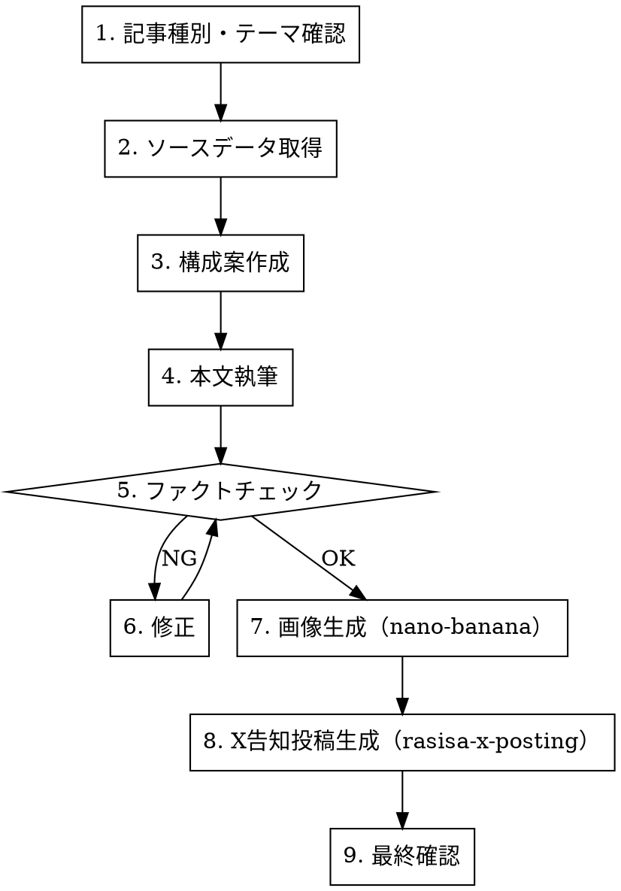

# RASHISA note 記事作成

RASHISA の note 記事を作成するワークフロースキル。タイプ解説・統計・活用法記事を、ソースコード上のJSONデータを正として品質を担保する。

## Workflow



## Step 1: 記事種別・テーマ確認

| 種別 | 内容 | 想定文字数 |
|------|------|-----------|
| **type-detail** | タイプ解説（MBTI/ラブタイプ/強み等） | 3,000〜5,000字 |
| **stats** | 統計・ランキング | 2,000〜3,000字 |
| **howto** | 活用法・使い方ガイド | 2,000〜4,000字 |
| **devlog** | 開発裏話 | 1,500〜3,000字 |

ユーザーに確認: 種別 / 対象テンプレート / 対象タイプ（あれば）

## Step 2: ソースデータ取得

**必ずJSONデータを Read ツールで取得**してから執筆する。推測で書かない。

| テンプレート | データパス |
|-------------|-----------|
| MBTI | `src/client/data/mbti/{TYPE}.json` |
| ラブタイプ | `src/client/data/lovetype/{type}.json` |
| 強み | `src/client/data/strengths-type/` |
| 社会人基礎力 | `src/client/data/social-360-type/` |
| エンジニア | `src/client/data/engineer-360-type/` |
| テンプレート設問 | `src/config/templates/{name}.json` |

## Step 3: 構成案作成

### タイプ解説記事の構成テンプレート

```markdown
# {タイプ名}（{キャッチフレーズ}）を徹底解説

## このタイプの特徴
- タグ・キーワード
- 出現率

## 自己評価 vs 他己評価のギャップ
- RASHISA ならではの「他者の目」視点

## 有名人・キャラクター
- データから引用

## 恋愛・人間関係の傾向（該当テンプレートのみ）

## 相性の良いタイプ / 苦手なタイプ

## RASHISAで診断してみよう
- CTA + URL
```

### 統計・ランキング記事の構成テンプレート

```markdown
# {テーマ}

## 調査概要
- 対象テンプレート・期間・サンプル数

## ランキング結果
- 図表で視覚的に

## 考察
- 意外なポイント・トレンド

## あなたも診断してみよう
- CTA
```

## Step 4: 本文執筆

### ライティングガイドライン

- **トーン**: カジュアルだが信頼感がある。「〜だよ」ではなく「〜です」「〜ですよね」
- **主語**: 「あなた」を多用。読者に語りかける
- **段落**: 3〜4行で改行。長い段落は分割
- **見出し**: H2は記事内5〜8個。H3は必要に応じて
- **太字**: 重要なキーワードを `**太字**` で強調（1段落に1〜2箇所まで）
- **引用**: タイプデータからの情報は正確に引用。数値を丸めない

### SEO ガイドライン

- **タイトル**: 32文字以内。キーワードを前方に配置
- **冒頭100字**: 結論 or フックを入れる（note の一覧表示で見える範囲）
- **キーワード**: タイプ名・テンプレート名・「RASHISA」を自然に含める

## Step 5: ファクトチェック

執筆後、以下を検証する:

| チェック項目 | 方法 |
|-------------|------|
| タイプ名・キャッチフレーズ | JSONデータと突合 |
| タグ・出現率 | JSONデータと突合 |
| 有名人・キャラクター | JSONデータと突合 |
| 相性タイプ | JSONデータと突合 |
| テンプレートの軸名 | テンプレートJSONと突合 |
| URL・リンク先 | 正しいパスか確認 |

**不一致があれば修正してから次へ進む。**

## Step 6: 画像生成（nano-banana）

### ヘッダー画像

```bash
gemini --yolo "/generate 'modern flat illustration for blog article about {テーマ}, teal (#00B5AD) and coral (#FF7E67) color scheme, clean minimal design, no text' --preview"
```

サイズ: 1280x670（note推奨）

### 本文中インフォグラフィック（必要に応じて）

- レーダーチャートのイメージ図
- タイプ比較表のビジュアル
- 軸の解説図

## Step 7: X 告知投稿生成

記事が完成したら、`rasisa-x-posting` スキルを invoke して告知投稿を作成する。

告知投稿のパターン:
```
[記事の核心を1文で] + [記事URL] + [ハッシュタグ]
```

## Step 8: 最終確認

```
📝 note 記事
─────────────────
タイトル: {タイトル}
文字数: {N}文字
種別: {type-detail / stats / howto / devlog}
ファイル: sns/note/articles/{ファイル名}.md

🖼️ 画像
ヘッダー: sns/note/images/{ファイル名}.png

🐦 X 告知投稿
{投稿文テキスト}
ファイル: sns/x/posts/{ファイル名}.md

📋 チェックリスト
- [ ] タイトル 32文字以内
- [ ] ファクトチェック済み（JSONデータ突合）
- [ ] ブランドボイス一貫性
- [ ] ヘッダー画像あり
- [ ] CTA（RASHISA誘導）あり
- [ ] X告知投稿あり
```

## Common Mistakes

| ミス | 対策 |
|------|------|
| JSONデータを読まずに執筆 | **必ず** Step 2 でデータ取得。推測禁止 |
| タイプ名の表記揺れ | JSON の `name` フィールドを正とする |
| 長すぎる記事 | 5,000字を超えたら分割を検討 |
| CTAなし | 記事末尾に必ず RASHISA への導線を入れる |
| X告知をスキップ | 記事単体では拡散しない。必ず告知投稿を作る |
