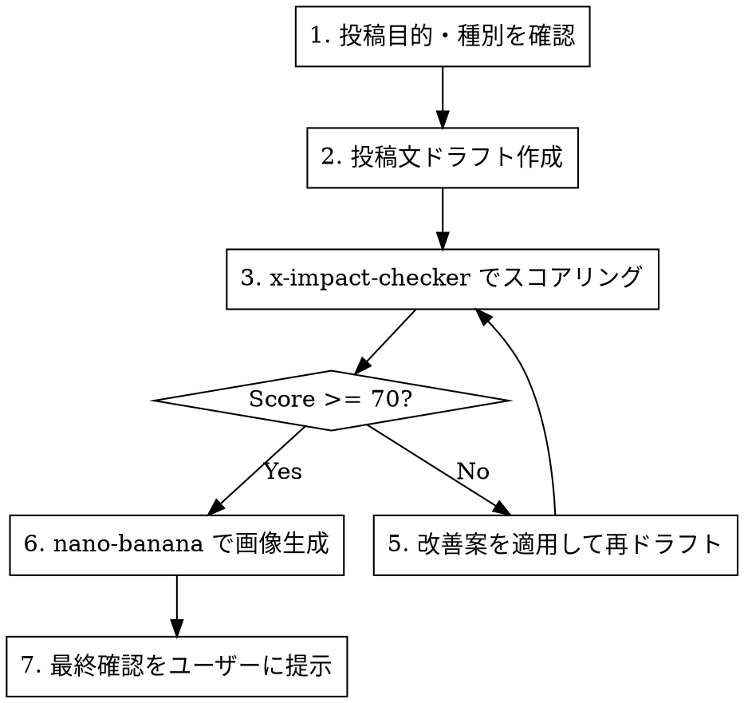

# RASHISA X Posting

RASHISA のX投稿を作成・添削するワークフロースキル。投稿文の品質を `x-impact-checker` でスコアリングし、画像が必要なら `nano-banana` でアイキャッチ画像を生成する。

## Codex 互換ルール

- `x-impact-checker` が利用可能なら優先して使う
- `x-impact-checker` が存在しない環境では、この skill 内で手動採点して代替する
- 添削だけが目的なら画像生成は必須ではない
- 画像生成を行う場合は `nano-banana` を使う

## Workflow



## Step 1: 投稿目的・種別を確認

ユーザーに確認すべき項目：

| 項目 | 選択肢 |
|------|--------|
| **投稿種別** | feature（機能紹介）/ tips（使い方）/ engagement（質問・対話）/ insight（自己分析の知見）/ launch（リリース告知）/ other |
| **ターゲット** | 学生 / 若手社会人 / エンジニア / 一般（デフォルト：Z世代全般） |
| **トーン** | カジュアル / 真面目 / 挑発的（デフォルト：カジュアル） |
| **画像の有無** | あり / なし（デフォルト：あり） |
| **URL を含めるか** | あり / なし |

ユーザーが投稿内容の方向性を既に示している場合、不足情報のみ確認する。

## Step 2: 投稿文ドラフト作成

### Brand Voice ガイドライン

- **プロダクト名**: RASHISA（らしさ）
- **キャッチコピー**: 「自分らしさ」と「他者の目」を掛け合わせた自己分析
- **トーン**: 親しみやすく、好奇心を刺激する。説教くさくない。
- **主語**: 「あなた」を多用。ユーザー視点で語る。
- **禁止**: 過度な煽り、虚偽の数値、競合比較
- **推奨ハッシュタグ**: #RASHISA #らしさ #自己分析 #自分らしさ
  - 種別に応じて追加: #MBTI #就活 #自己理解 #360度評価

### テンプレート別フック

| テンプレート | 訴求ポイント |
|-------------|-------------|
| MBTI診断 | 「自分が思うMBTIと、友達から見たMBTI、同じだった？」 |
| ラブタイプ | 「恋愛傾向、自分では分からない"クセ"がある」 |
| 強み分析 | 「自分の強み、自覚してるのと周りが思ってるの、ズレてない？」 |
| 社会人基礎力 | 「社会人力、自己評価と他己評価のギャップに驚く」 |
| エンジニア360° | 「エンジニアとしての"らしさ"、コードレビューじゃ分からない」 |

### 文字数ガイド

- **通常投稿**: 100〜200文字（日本語）。短いほど良い。
- **スレッド**: 1ツイート目で完結する強いフック + 続きはリプライ
- **URL込み**: URLで約23文字消費。本文は117〜177文字に収める。

## Step 3: x-impact-checker でスコアリング

ドラフト完成後、まず `x-impact-checker` が使えるか確認する。

- 使える場合: **必ず** invoke してスコアリングする
- 使えない場合: 下の手動 rubric で 100 点満点採点し、同じ閾値で改善判断する

```
投稿文をスコアリング：
「[ドラフトした投稿文]」
```

### スコア基準

| スコア | アクション |
|--------|-----------|
| 70以上 | 画像生成ステップへ進む |
| 50-69 | 改善提案を適用して再スコアリング（最大2回） |
| 49以下 | ドラフトを根本的に書き直す |

**注意**: x-impact-checker の改善提案（Top 5 Improvements）と最適化バージョンを参考にする。ただし RASHISA のブランドボイスを維持すること。

### 手動 rubric（x-impact-checker 不在時）

各 20 点、合計 100 点で採点する。

| 観点 | 見るポイント |
|------|-------------|
| **フック** | 冒頭1文で止まれるか。弱い説明調になっていないか |
| **具体性** | 抽象論だけでなく、利用シーンや気づきがあるか |
| **ブランド適合** | RASHISA の「自分らしさ × 他者の目」が伝わるか |
| **拡散性** | 引用・返信・保存したくなる問いや意外性があるか |
| **圧縮度** | 長すぎず、冗長語や重複が削れているか |

手動 rubric を使う場合も、70 点未満なら改善案を出し、最大 2 回まで再ドラフトする。

## Step 4: nano-banana で画像生成

スコア70以上の投稿文が確定したら、画像を生成する。

### 画像仕様

| 項目 | 値 |
|------|-----|
| サイズ | 1200x675（X推奨 16:9） |
| スタイル | RASHISA デザインシステム準拠 |
| カラー | Primary: #00B5AD、Accent: #FF7E67、Gray: #757575 |
| フォント感 | 丸ゴシック系（M PLUS Rounded 1c のイメージ） |
| モチーフ | シーサー（マスコット）を適宜使用 |

### プロンプト構成

```bash
gemini --yolo "/generate '[投稿種別に応じたプロンプト], teal (#00B5AD) and coral (#FF7E67) color scheme, modern flat illustration style, clean minimal design, no text' --preview"
```

### 種別別プロンプト例

| 種別 | プロンプトの方向性 |
|------|-------------------|
| feature | プロダクトUIのイラスト、スマホ画面、レーダーチャート |
| tips | ステップ図解、矢印、アイコン |
| engagement | 人物シルエット、？マーク、対話のイメージ |
| insight | グラフ、データビジュアライゼーション、脳・ひらめき |
| launch | 祝祭的、紙吹雪、ロケット |

## Step 5: 最終確認

ユーザーに以下を提示する：

```
📝 投稿文（確定版）
─────────────────
[投稿文テキスト]

🎯 x-impact-checker スコア: XX/100 (Grade: X)

🖼️ 画像
[生成した画像のパス]

📋 投稿チェックリスト
- [ ] 文字数: XXX文字（制限内）
- [ ] ハッシュタグ: 適切
- [ ] URL: 正しいリンク先
- [ ] 画像: 投稿内容と一致
- [ ] ブランドボイス: RASHISA らしさを維持
```

## 投稿種別ごとの構成パターン

### feature（機能紹介）
```
[機能の価値を1文で] + [具体例 or 使い方] + [CTA] + [ハッシュタグ]
```

### tips（使い方）
```
[「知ってた？」系フック] + [具体的なTips] + [URL] + [ハッシュタグ]
```

### engagement（質問・対話）
```
[問いかけ] + [選択肢 or 自分の回答例] + [ハッシュタグ]
```

### insight（自己分析の知見）
```
[驚きのデータ or 気づき] + [解説] + [RASHISA への導線] + [ハッシュタグ]
```

### launch（リリース告知）
```
[ニュース] + [何ができるか] + [URL] + [ハッシュタグ]
```

## Common Mistakes

| ミス | 対策 |
|------|------|
| 長すぎる投稿 | 200文字以内に収める。削れるなら削る |
| ハッシュタグ過多 | 2〜4個が最適。5個以上はスパム感 |
| 機能説明に偏る | ユーザーの「体験」や「気づき」を軸にする |
| x-impact-checker をスキップ | `x-impact-checker` があれば使う。なければ手動 rubric で必ず採点する |
| 画像なしで投稿 | 画像付きはエンゲージメント2〜3倍。原則つける |
| ブランドボイスの逸脱 | 「RASHISA らしい」親しみやすさを常に意識 |
