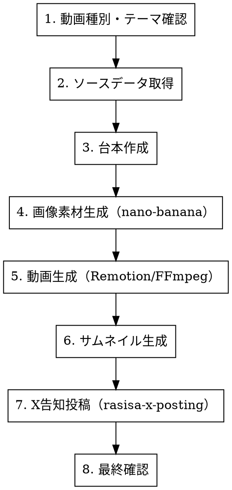

# RASHISA YouTube Shorts / TikTok 動画作成

RASHISA のショート動画（YouTube Shorts / TikTok）を作成するワークフロースキル。台本→画像素材→動画→サムネイルの一貫生成。

## Workflow



## Step 1: 動画種別・テーマ確認

| 種別 | 尺 | 内容 |
|------|-----|------|
| **type-intro** | 30秒 | タイプ紹介（MBTI/ラブタイプ等、1タイプ1動画） |
| **aruaru** | 15〜30秒 | タイプ別あるある3選 |
| **comparison** | 30〜45秒 | 自己評価 vs 他己評価の比較 |
| **howto** | 45〜60秒 | RASHISAの使い方チュートリアル |
| **ranking** | 30〜45秒 | タイプ別ランキング |

ユーザーに確認: 種別 / 対象テンプレート / 対象タイプ

## Step 2: ソースデータ取得

note スキルと同様、**必ずJSONデータを Read で取得**。

| テンプレート | データパス |
|-------------|-----------|
| MBTI | `src/client/data/mbti/{TYPE}.json` |
| ラブタイプ | `src/client/data/lovetype/{type}.json` |
| 強み | `src/client/data/strengths-type/` |
| 社会人基礎力 | `src/client/data/social-360-type/` |
| エンジニア | `src/client/data/engineer-360-type/` |

## Step 3: 台本作成

### 台本フォーマット

```markdown
# {動画タイトル}

## メタ情報
- 種別: {type-intro / aruaru / comparison / howto / ranking}
- 尺: {N}秒
- テンプレート: {MBTI / ラブタイプ / ...}
- タイプ: {INTJ / LCPO / ...}

## シーン構成

### シーン1（0:00-0:03）— フック
- 画面: {画面の説明}
- テキスト: {画面上のテキスト}
- ナレーション: {読み上げテキスト（TTS用）}

### シーン2（0:03-0:10）— 本題
...

### シーンN（最終）— CTA
- 画面: RASHISA ロゴ + URL
- テキスト: 「あなたも診断してみない？」
- ナレーション: 「リンクは概要欄から」
```

### 種別別構成パターン

**type-intro（30秒）:**
```
[0:00-0:03] フック: 「{タイプ名}ってどんな人？」
[0:03-0:08] 特徴1: キャッチフレーズ + タグ
[0:08-0:15] 特徴2: 行動パターン・口癖
[0:15-0:22] 特徴3: 恋愛 or 仕事での傾向
[0:22-0:27] 有名人: 「{有名人}もこのタイプ」
[0:27-0:30] CTA: 「あなたは何タイプ？」+ URL
```

**aruaru（15〜30秒）:**
```
[0:00-0:03] フック: 「{タイプ名}あるある」
[0:03-0:10] あるある1
[0:10-0:17] あるある2
[0:17-0:24] あるある3
[0:24-0:30] CTA
```

**comparison（30〜45秒）:**
```
[0:00-0:03] フック: 「自分のMBTI、友達に聞いたら違った件」
[0:03-0:15] 自己評価パート: 自分が思う自分
[0:15-0:30] 他己評価パート: 友達から見た自分
[0:30-0:40] ギャップ解説: なぜズレるのか
[0:40-0:45] CTA
```

### テキスト表示ルール

- **フォントサイズ**: 大きく。モバイル縦持ちで読める最小は24pt相当
- **1画面の文字数**: 最大20文字程度。長いテキストは複数画面に分割
- **配置**: 画面中央〜やや上。下部はYouTubeのUIに被る
- **色**: 白テキスト + 黒縁 or 背景にRASHISAカラーのオーバーレイ

## Step 4: 画像素材生成（nano-banana）

台本の各シーンに対して画像を生成する。

### 画像仕様

| 項目 | 値 |
|------|-----|
| サイズ | 1080x1920（9:16 縦型） |
| カラー | Primary: #00B5AD、Accent: #FF7E67 |
| スタイル | フラットイラスト、モダン、ミニマル |

### プロンプト例

```bash
# タイプ紹介の背景画像
gemini --yolo "/generate 'vertical 9:16 modern flat illustration representing {タイプの特徴}, teal (#00B5AD) and coral (#FF7E67) color scheme, clean minimal design, no text, suitable for vertical short video background' --preview"

# あるあるシーンの背景
gemini --yolo "/generate 'vertical 9:16 illustration of {あるあるの場面}, cute minimal style, teal and coral accents, no text' --preview"
```

各シーンの画像を `sns/youtube/thumbnails/` に保存。

## Step 5: 動画生成

### 方法A: Remotion（推奨）

Remotion スキルが利用可能な場合、React コンポーネントとして動画を構成する。

- 画像 + テキストオーバーレイ + トランジション + BGM
- `npx remotion render` で MP4 出力
- 出力先: `sns/youtube/videos/`

### 方法B: FFmpeg（シンプル版）

```bash
# 画像スライドショー + テキストオーバーレイ
ffmpeg -framerate 1/5 -i scene_%02d.png \
  -vf "scale=1080:1920,drawtext=text='テキスト':fontsize=48:fontcolor=white:x=(w-text_w)/2:y=(h-text_h)/2" \
  -c:v libx264 -pix_fmt yuv420p \
  -t 30 output.mp4
```

### 方法C: AI動画生成（高品質が必要な場合）

Veo 3.1 / Kling API で画像→動画変換。コストが発生するためユーザー確認を取る。

## Step 6: サムネイル生成

```bash
gemini --yolo "/generate 'eye-catching YouTube thumbnail, vertical 9:16, bold text area at top, {タイプ名} personality type, teal (#00B5AD) background with coral (#FF7E67) accent, modern flat design, no text' --preview"
```

サムネイル上のテキストは後から Remotion / 画像編集で追加する想定。

## Step 7: X 告知投稿

動画完成後、`rasisa-x-posting` スキルを invoke して告知投稿を作成。

```
[動画の核心フック] + [YouTube/TikTok URL] + [ハッシュタグ]
```

## Step 8: 最終確認

```
🎬 動画
─────────────────
タイトル: {タイトル}
種別: {type-intro / aruaru / ...}
尺: {N}秒
台本: sns/youtube/scripts/{ファイル名}.md

🖼️ サムネイル
sns/youtube/thumbnails/{ファイル名}.png

🎥 動画ファイル
sns/youtube/videos/{ファイル名}.mp4

🐦 X 告知
{投稿文}

📋 チェックリスト
- [ ] 最初3秒にフック（スクロール停止）
- [ ] テキスト: モバイル縦持ちで読める大きさ
- [ ] 9:16 縦型
- [ ] 尺: 60秒以内
- [ ] CTA（RASHISA誘導）あり
- [ ] タイプデータとの整合性（ファクトチェック）
- [ ] サムネイルあり
- [ ] X告知投稿あり
```

## Common Mistakes

| ミス | 対策 |
|------|------|
| フックが弱い | 最初3秒で「自分ごと」にする問いかけ or 驚き |
| テキストが小さい | 24pt相当以上。モバイル縦持ちが前提 |
| 尺が長すぎる | 60秒厳守。内容が多ければ分割 |
| 横型で作成 | 9:16 縦型必須。1080x1920 |
| データ不正確 | JSONデータを必ず Read してから台本作成 |
| BGMなし | 動画には必ずBGMを入れる（著作権フリー） |
| X告知なし | 動画単体では拡散しない。必ず告知投稿を作る |
